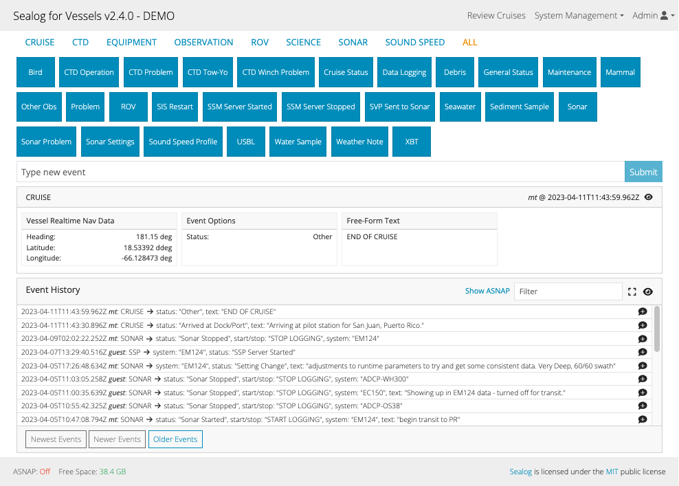
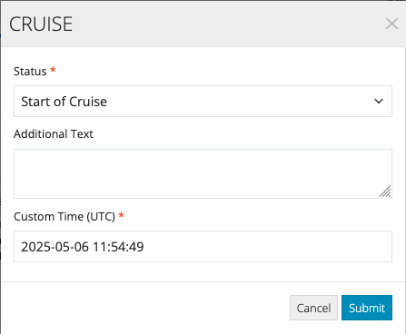

There are three ways to submit events from the Sealog client:
1. the event templates (blue buttons)
2. the free-form text field.
3. direct API call to the server

## Using the Event Templates
To submit and event via an event template, simply click on the desired template (blue button).  Event templates can be organized into categories. The available categories are listed above the event templates.  Click on a new category will change the list of event templates displayed.

Depending on the template, a modal window may appear requesting additional information to complete the event.

### Submitting events with custom timestamps
If you need to submit an event for a specific time, use the 'Custom Time (UTC)' field in the event template modal window to select the desired time. For templates that do not create a modal, hold SHIFT when clicking the blue button and a modal will appear. 

## Using the Free-form Text Field
Free-form events are for when an event needs to be capture for which there is no event template. To submit a free form type the event text into the text field below the event templates and click the “Submit” button.

## Event Comments
An underlying philosophy with Sealog is that events are not changed after initially submitted. However circumstances exist where an event is incorrect or incomplete. In those circumstances users can provide an additional comment a previously submitted event. Examples of comment content include:
- An observation is incorrect
- Additional observations not included in the original event submission
- Preliminary notes on the importance of an event

To add/edit an event comment field click the message bubble icon next to the desired event. This will display a new modal window for adding/editing the comment. The comment is in no way protected from other users changing or deleting a comment.

## Direct API Call to the Server
Events can also be submitting via a direct call to the Sealog Server API. Please refer to [Using the API]({{ "/server_using_api/" | relative_url }})