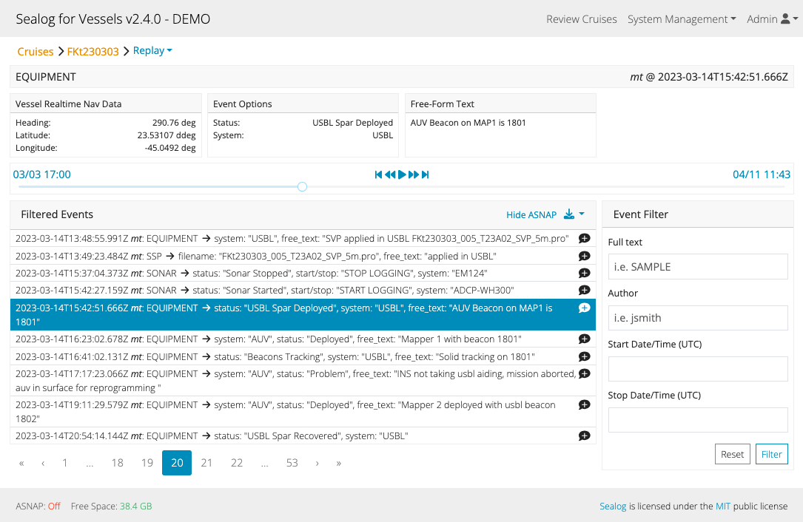

### Login
The first screen users see when they connecting to Sealog is the login screen.  The login screen includes a login form containing the standard username/password elements, a login button, a link to create a new account and a link to retrieve a forgotten password.

Logins are required however there is a “Login as Guest” button for operators that do not wish to manage individual user accounts.
Passwords for accounts are also optional.

#### Register
Potential users can self-register using the "Register New User" button on the login page and completing the form that follows.  Depending how the server is configured the new account may have to be authorized by an admin user prior to use.

#### Lost/Forgotten Password
Users can reset lost/forgotten password using the "Forgot Password?". They only need to remember the email used when registering the account. If the email address used is unknown then an admin must retrieve the email address and/or reset the password.

### Event logging
After successfully logging into Sealog the user will be at the main event logging page (unless eventlogging is disabled.) This is where user can submit new event and view events submitted by other users in realtime.  Please refer to the [Event Logging]({{ "/event_logging/" | relative_url }}) page for more information on how to submit events.

### Review Cruises/Lowerings
To review the current and previous cruises/lowerings click the "Review Cruises" text in the top-navigation bar. This will display the page for selecting the desired Cruise/Lowering to review.  The page includes instructions on selecting and reviewing cruises/lowerings.

After selecting a Cruise/Lowering, click "Replay" to review the events and their ancillary data, click "Map" to see the events and where the ship/vehicle was geographically when the event was submitted.

### Search and Export
Users can review all cruise/lowering events from the Replay or Map pages. Both pages include an "Event Filter" form that allows users to perform a full text search of events and/or filter by author and/or date/time.

The download icon on the right-side of the "Filtered Events" card is used for exporting the currently displayed list of events.  The events can be exported in several ways.  The most commonly used option is CSV-Format -> Events w/aux data.  This produces a comma-delimited file appropriate for import into a spreadsheet.

