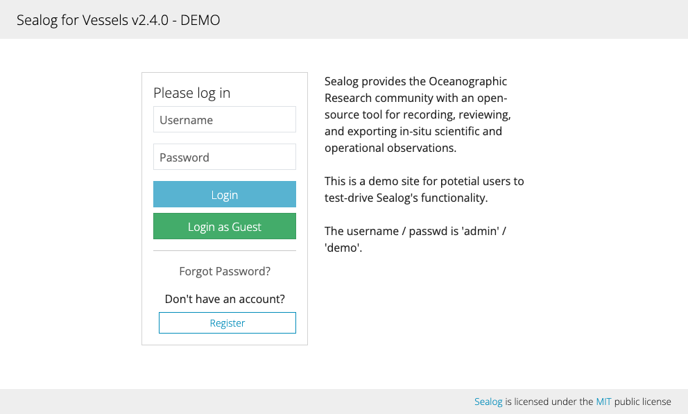
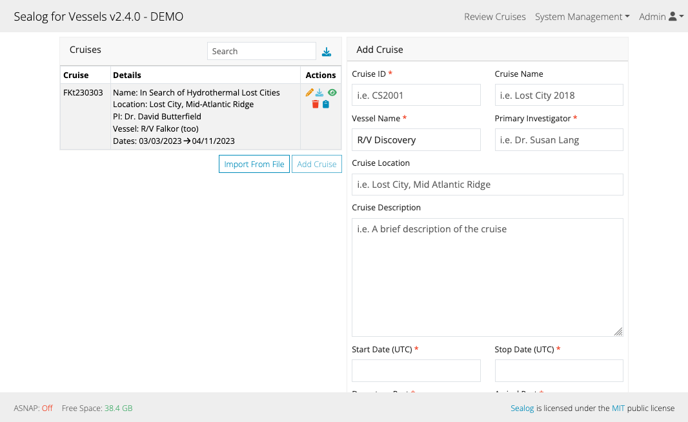

The Sealog Client is the web-based UI. It can be used on any device with a modern web-browser including smart phones and tablets. The only other requirement is that the device have network access to the sealog server.

### Login Screen

The first page users see when they connecting to Sealog is the login page. The login page contains the standard username/password elements, a login button, a button to register a new accounts and a button to retrieve forgotten passwords.

Sealog requires all users to have an account however there is a "Guest" account that anyone can use to access the event-logging and cruise/lowering review pages.

### Main Event-Logging Screen

After logging into Sealog, users arrive at the event-logging page. The event-logging page is where users submit new events and view recently submitted events. The event-logging page includes the following elements:
- Navigation Bar
- Event templates (blue buttons),
- Free-form text field,
- Recent event history,
- Sealog Auto-Snapshot (ASNAP) service status

#### Navigation Bar
The navigation bar at the top of the page includes dropdown menus to the various parts of the client. The user's roles determined the contents of the navigation bar and dropdown menus.

#### Event Templates
Below the navigation bar is a row of event template categories followed by an array of event templates (blue buttons).

Event templates can be organized into one or more categories. Clicking on the category names about the event templates with show all templates for the selected category.

Clicking on the templates button will open a dialog window for completing the event submission. If an event templates does not require the user to provide any additional information the event will be submitted immediately and without a dialog window.

#### Free-form text field
The free-form text field is a text input field for submitting in-situ events for which there is no event template already defined. To add a free-form event simply type the text you wish to record and click the "Submit" button.

#### Recent Event History
The recent event history card displays recently submitted events. This element is updated automatically as new events are submitted.
There are two parts to this UI elements.
1. The top part contains the most recent event. It also shows any event options and ancillary data associated with the event.
2. The bottom part displays the last 20 events submitted by all users. Clicking on the text for an event in this list will display a modal containing the event's options and ancillary data. The filter text field in the Event History header allows user to filer the events show in the list.

If desired either of these elements can be hidden to simplify the UI.

#### ASNAP Service Status and Free Disk Space
The bottom element of the UI displays the status of the ASNAP service and the amount of free disk space left on the server running Sealog.

### Reviewing Cruises/Lowerings

To review the events from a lowering, click the “Review Cruises” link from the navigation bar. This will display the cruise/lowering review selection page.
Use the interface to select the desired year, cruise and lowering. The interface will display the information stored within the selected cruise and lowering records.

#### Cruise/Lowering Review Modes
Once the desired cruise/lowering is selected, the UI will present a three options for reviewing the cruise/lowering. Click the 'Review' dropdown in the Cruise/Lowering card to see the available options.
- Replay → VLC-style controls and a slider for scanning through a cruise/lowering. All associated data for a given event is displayed including previews of image data (sealog-vehicle only).
- Map → Similar to Replay and Review but with a focus on the position where the event was created. This interface includes a map of the lowering trackline and a slider for quickly scanning through the lowering.
- Gallery (sealog-vehicle only) → Displays only the image data collected for each event, organized by camera name.



#### Filtering/Exporting Events
All review mode include an event filter form. This form is used to filtered the events shown in the review. Events can be filtered by text, author or, time. The search form is case insensitive and partial matching is supported. Use commas between event values to search for multiple event values (i.e. FISH, CORAL). Prefixing an event value with a “!” character will perform a logical NOT operation.

To export the displayed events, use the download icon on the right-side of the fitered events table header. Clicking the download icon will display options for exporting the event data with or without their ancillary data and in either JSON or CSV format.

### System Managment
Depending on the user's role there will be a "System Management" dropdown in the top-bar navigation. The options available in the "System Management" dropdown will also be dependent on the user's roles.

The availble options include:
- Cruises
- Event Management
- Event Templates
- Lowerings (Sealog-Vehicle only)
- Users

#### Cruise / Lowering Records

Cruise and Lowering records are used to organize events for review and export. These records contain information such as the cruise name, vessel name, PI, cruise/lowering locations, start/stop times, participant lists, description/summaries, etc.

The Cruise and Lowering sections are organize in a similar manner. Each section has 2 main components:
- Table of cruises/lowerings
- Form to Add/Edit a cruise/lowering
- Button to Import cruises/lowerings from file.

##### Table of Cruises/Lowerings
The cruise/lowering table displays all cruises/lowerings available in Sealog. The search text field at the header of the cruise/lowering table is for filtering the list. The download icon next to the search text field can be used to export all the cruises in the table to file (json-formatted).

To edit an existing cruise/lowering click the pencil icon next to the desired cruise/lowering.

To run the export process against a specific cruise/lowering, click the download icon next to the desired cruise/lowering.

To delete an existing cruise/lowering click the trash can icon next to the desired cruise/lowering. The client will prompt the user to confirm the action before completing the deletion.

To hide a cruise/lowering from non-admin users click the eye icon next to the desired cruise/lowering. To un-hide a cruise/lowering from non-admin users click the slash-eye icon next to the desired cruise/lowering. 

##### Adding/Editing Cruises/Lowerings
When first arriving to the Cruises / Lowerings page the cruise/lowering form is ready to immediately start creating a new cruise/lowering. Selecting a cruise/lowering from the cruise/lowering table will populate the form with the contents of the cruise/lowering record. Required fields are designated with a red asterisks. These fields must have valid values prior to submission. When the form is completed, click the blue “Create” or “Update” button to save the cruise/lowering record.

##### Exporting Cruises/Lowerings
It is possible to export cruises/lowerings to file. There are two reasons to export cruises/lowerings:
1. Including the cruise/lowerings as part of the cruise/lowering data package
2. Wanting to transfer the cruises/lowering records to another Sealog instance

Click the download icon in the header of the cruise/lowering table to export the cruise/lowering records to file. Only cruise managers and admins can export Cruises/Lowerings.

##### Importing Cruises/Lowerings from file 
Use the blue “Import From File” button located below the Cruises/Lowerings table to import cruises/lowerings from file. This button is only available to admin users. Clicking the button will open a modal window with a button to select a file for import. After selecting the file the modal will display the number of cruises/lowerings found in the file and real-time counter displaying the number of cruises/lowerings pending, imported, skipped (because they already exist) and errors (problem with the cruise/lowering data in the file).

##### Additional Lowering Functionality (Sealog-Vehicle only)
There is additional functionality for instances of Sealog where vehicle navigation is part of the event ancillary data. A "Milestones/Stats" button at the bottom of the lowering form will open a modal form for editing the lowerings milestones and stats (bounding-box, max depth).

#### Event Management

The Event Management page allows admin and event manager users to view all events in the Sealog database. The Event Management page includes a table of events, with the event export icon and the same event filter form found on the cruise review pages.

#### Event Templates

The Event Templates page is used for adding/editing event templates. Event templates can be added / edited at anytime by admin and template manager users. The Event Templates page has 4 parts:
- A list of system event templates
- A list of non-system event templates,
- A button to add a new event template
- A form used for creating/editing event templates

##### System vs Non-System Event Templates
There are 2 classes of event templates: system and non-system. System event templates are defined by the vessel/vehicle operators and can only be edited by admin users. These events can also be otionally hidded on the event logging page from non-admin users.

Non-system event templates can be created by template manager or admin users. These templates are expected to change often from cruise-to-cruise to meet the needs of science party.

##### Adding/Editing Event Templates
When first arriving to the Event Templates page the event template form is ready to immediately start building a new event template.

Click the test-tube icon to preview what a template will look like on the main event-logging page.

Click the trash can icon to delete an event template. A confirmation dialog will appear before performing the template is deleted.

To edit an existing template click the pencil icon next to the desired template. This will populate the form with the contents of the selected event template.

The most basic event template includes:
- Button Name →  the name that will appear on the blue button.
- Event Value → the string that will be submitted as the event’s value.
- Free text Required → whether or not the observer MUST add some free-form text before submitting the event.

By default a new event template does not have any event options. To add an event option click the blue “Add Option” button. There are five types of event options:
- Text → allows entering free-form text.
- Static Text → a text field where the exact text is pre-determined and cannot be changed.
- Dropdown → allows selected one value from a pre-defined list.
- Radio Buttons → allows selected one value from a pre-defined list.
- Checkboxes → allows selected one or more from a pre-defined list.

Each event option form includes a “Require” switch. This specifies that the option must be completed prior to event submission.

##### Hiding templates from non-admin users
In cases where a template should only be available to ship's personnel and hidden from others to prevent accidentail use, there is the "Only available to admins" switch. This option can only be seen/enabled by admin users and is only availble to system templates.

##### Exporting Event Templates
It is possible to export event templates to file. There are three reasons to export event templates:
1. Including the event templates as part of the cruise/lowering data package
2. Wanting to transfer the template records to another Sealog instance
3. Wanting to restore the event templates used on a previous cruise to the current cruise.

Click the download icon in the header of the System and non-System event template tables to export the event template records to file. Only admin users can export system templates. Admin and template manager users can export non-System event templates.

##### Importing Event Templates from file 
Use the blue “Import From File” button located below the Event Template tables to import event templates from file. This button is only available to admin users. Clicking the button will open a modal window with a button to select a file for import. After selecting the file the modal will display the number of event templates found in the file and real-time counter displaying the number of event templates pending, imported, skipped (because they already exist) and errors (problem with the cruise/lowering data in the file).

#### Users

The Users page is used for adding/editing Sealog users. Users can be added / edited at anytime by admin and cruise manager users. The Users page has 4 parts:
The Users section has 4 parts:
- A list of system users
- A list of non-system users,
- A button to add a new user
- A form for creating/editing users

##### System vs Non-System Users
There are 2 classes of users: system and non-system. System users are for account that do not change between cruises and that should only be modified by admin users. Non-system users can be created by cruise manager and admin users. These are the users that may change from cruise-to-cruise.

##### Table of Users
The user tables display all Sealog accounts. The search text field within the header of the user tables are for filtering the user lists. The download icon next to the search text field is for export the corresponding list to file.

Click the pencil icon the edit a user record.

Click the trash can icon to delete an event template. A confirmation dialog will appear before performing the template is deleted.

##### Adding/Editing Users
When first arriving to the Users page the user form is ready to immediately start building a new user.

When editing an existing user the form will populate with the contents of the selected user record. Required fields are designated with a red asterisks. Click the blue “Create” or “Update” button to save the user record.

Certain parts of user records can only be changed by admin users. These options include promoting/demoting users between system and non-system and disabling a user.

##### Exporting Users
It is possible to export users to file. There are three reasons to export users:
1. Wanting to make a backup of the users table.
2. Wanting to move/copy the user records to another Sealog instance
3. Wanting to restore users from a previous cruise.
To export users to file, click the download icon in the header of the users tables. Only Admin users can export system users. Cruise Managers and Admins can export non-system users.

##### Importing Users from file 
To import users from a file, use the blue “Import From File” button located below the Users table. This button is only available to “admin” users. Clicking the button will open a modal window that presents the user with the option to select a file for import. After selecting the file the modal will display the number of users found in the file and real-time status messages displaying the number of users pending, imported, skipped (because they already exist) and errors (problem with the user data in the file).
