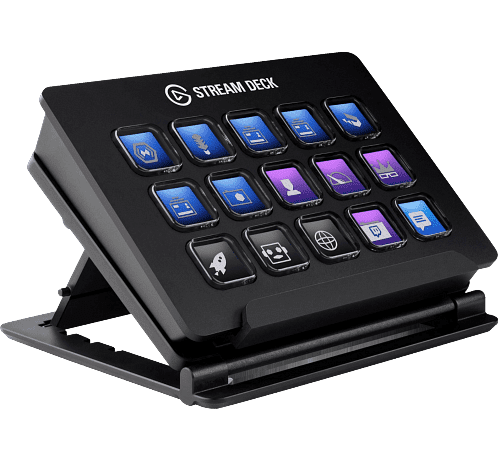
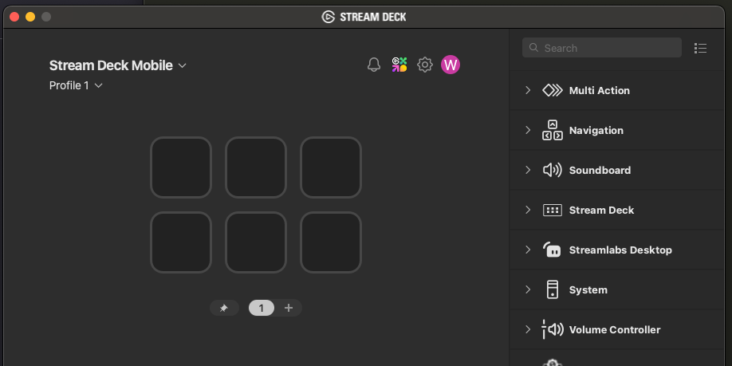
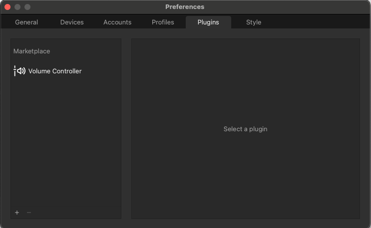
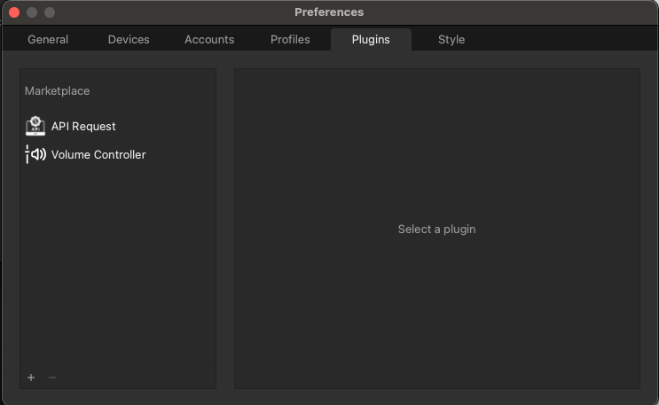
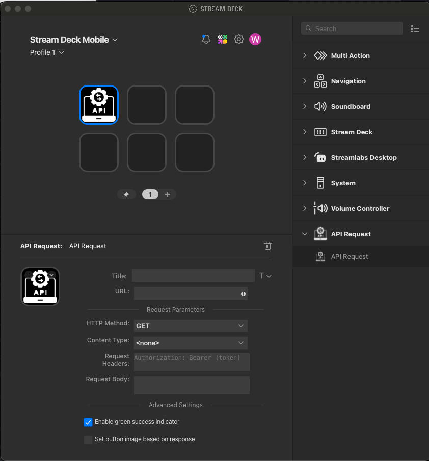

There are serveral scenarios where an operator may only need to submit events that do not required any additional details (i.e. ROV navigator). In these cases it may be more convient for the operator to submits events via a phyiscal device vs requiring the use of a web-browser. The [Elgato StreamDecks](https://www.elgato.com/us/en/p/stream-deck-mk2-black) are a great choice for such a physical device.

Here's how to setup a Streamdeck to submit Sealog events:

# Prerequisites

## Retrive the JWT for the intended Sealog User
Most calls to the Sealog Server API require a Javascript Web Token (JWT) that authenticates the requestor and authorizes whether or not to complete the request. Here's how to retrieve the JWT:
 1. Log into Sealog WebUI as the desired user.
 2. Click the username in the upper-right and select “User Profile” from the dropdown.
 3. Click the “Show API Token” button.  The JWT is the long string of random characters that appear.


## Retrieve the Sealog Server API URL
The Sealog Server API URL is the network address and port the Sealog Server listens on for incoming API request.

Typically the client and server are served on the same host so the IP/URL will be the same with only the port number being different. For deployments where there is only one instance of Sealog running the default port number for the Sealog API is 8000.  For installations where there is more than one Sealog instance the port numbers typically increment by 100 (8100, 8200, etc).

The port number for every Sealog Server instance is specified within the `<server_install_dir>/config/manifest.js` file.

The full Server API URL is `http://<IP/URL>:<port number>/sealog-server`

## Installing the API Request plugin
This guide does NOT include how to physically install the Streamdeck or the Elgato software.  Please complete those tasks before continuing.

 1. Open Elgato Software
 2. Click the gear icon at the top to goto Preferences     
 
 3. Select the plugins tab
 4. Click the “+” sign at the bottom left to add a new plugin. A web-browser should open to the Elgato marketplace website.
 
 5. Use the search bar on the website to find the “API Request” plugin.
 6. Select the “API Request” plugin.
 7. Click “Open in Stream Deck” to install the plugin.
 
 8. Go back to the preferences window of the Streamdeck app. You should see that the API Request plugin has been installed.
 
 9. Close the preferences window and return to the main window. You should see an option to use the API Request plug-in as a button option.
 

# Configure Streamdeck Buttons
 1. Click the right facing chevron next to the API Request plugin.  It should now face downwards and show a second, slightly smaller API Request Icon and text.
 2. Drag this smaller icon to the button you want to configure.
 3. Complete the API Request form:
 

- Title: *What will appear on the Streamdeck button*
- URL: `<server API URL>/api/v1/events`
- HTTP Method: `POST`
- Content Type: `application/json`
- Request Headers:
```
Authorization Bearer: <user JWT>
accept: application/json
```
- Request Body:
```
{
    "event_value": "<event_value>",
    "event_options": [
      {
          "event_option_name": "<option1_name>",
          "event_option_value": "<option1_value>"
      },
      {
          "event_option_name": "<option2_name>",
          "event_option_value": "<option2_value>"
      }
  	  ...
    ]
}
```

Once you’ve completed the first button you should test that it works. When the button is pushed a green checkmark should appear on the Streamdeck. If a yellow caution appears something wrong with the button configuration. If the button push was successful, verify an event with the desired contents appeared in the Sealog WebUI.

For the rest of the buttons you can either re-run the these steps OR you can right-click the completed button in the Elgato software, select copy, right-click a different button and select paste. Then update title field and the “event_options” fields as desired.  Always verify any changes.